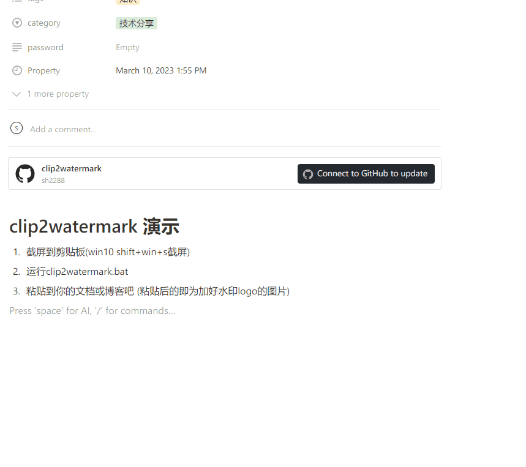
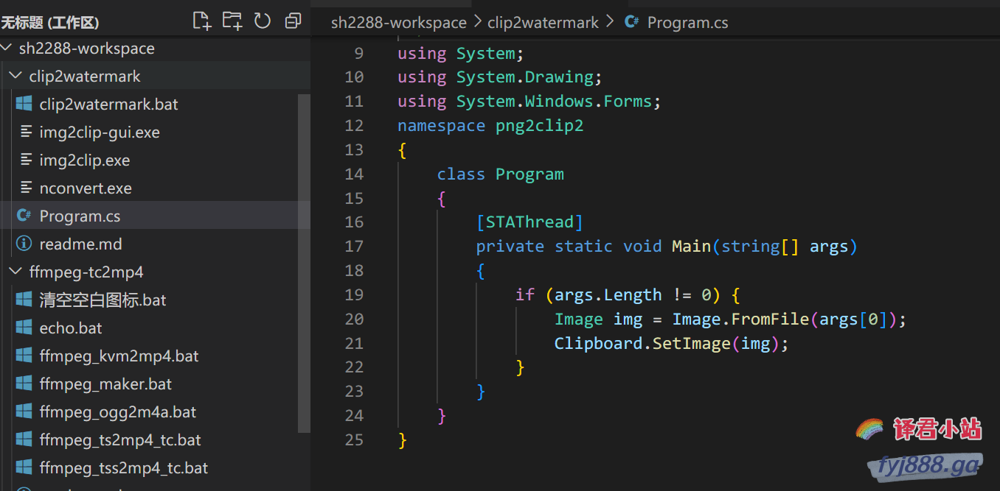

# 📣 clip2watermark 剪贴板图片加水印logo工具
[](https://github.com/sh2288/clip2watermark/releases/latest)  

<details> <summary>🎥 演示动图</summary>



</details>

---

# 🔎 原理
> 利用nconvert.exe读取剪贴板图片,添加指定水印,再送回到剪贴板
# 🌈 使用场景
制作各种计算机技术教程,需要一边截屏一边写博客或文档,又渴望快速插入自己水印logo的大神们
# 🈯 使用方法 
1. 截屏到剪贴板(win10 <kbd>Win</kbd> + <kbd>Shift</kbd> + <kbd>S</kbd> 截屏)
2. 运行clip2watermark.bat
3. 粘贴到你的文档或博客吧 (粘贴后的即为加好水印logo的图片)
# 🛠 命令批处理
```batch
nconvert.exe -clipboard  -overwrite -o clipboard -out png -wmflag bottom-right -wmopacity 80 -wmfile fyj888-logo.png
img2clip.exe clipboard.png
```
-wmopacity **80** 表示透明度80(0-100)

-wmflag **bottom-right** 表示下右位置添加水印logo 可用值:

    top-left, top-center, top-right
    center-left, center, center-right
    bottom-left, bottom-center, bottom-right

-wmfile **fyj888-logo.png** 水印logo 请换成你自己制作的

# ⌨️ 一行源码(程序虽然简单,愿能为你带来方便)
```c#
using System;
using System.Drawing;
using System.Windows.Forms;
namespace png2clip2
{
	class Program
	{
		[STAThread]
		private static void Main(string[] args)
		{
			if (args.Length != 0) {
				Image img = Image.FromFile(args[0]);
				Clipboard.SetImage(img);
			}
		}
	}
}
```
# 🎙️ demo
